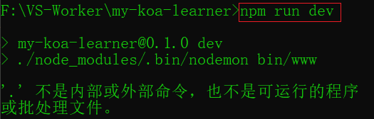
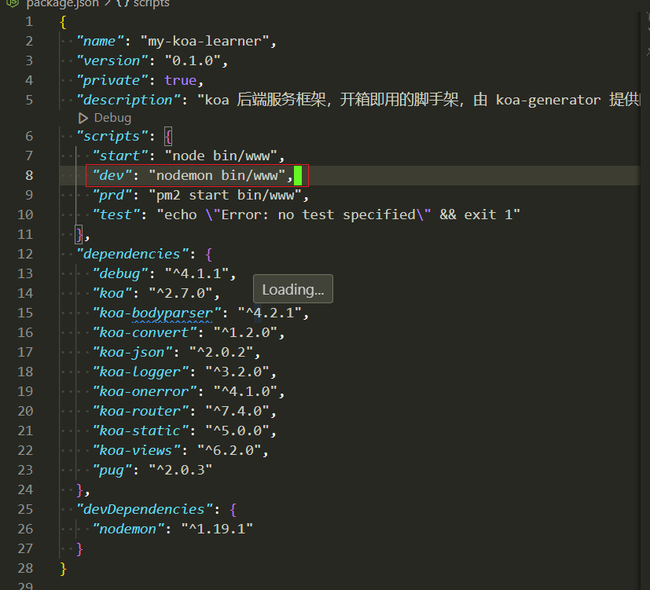

# 项目简介

koa 后端服务框架，开箱即用的脚手架，由 koa-generator 提供的 Koa2 命令安装实现

> 关于package.json 里面的scripts 的项目命令，star和test命令可以直接运行 'npm start' & 'npm test'
> 而dev 和 prd 命令需要运行 'npm run dev' & 'npm run prd'

## 问题解答

在package.json中想要使用 npm run dev 命令来启动项目，会遇到报错

:rage: 问题所在原因，目前还没找到
:alien: 所以搞一个更牛X的解决方法（**更改package.json文件里面的scripts项目命令**）

> :point_right: 在这之前需要先检查是否安装了 **nodemon** 这个工具包，顺便说下，这个包是用来做node自启动的，也就是说，当项目里面的任何文件发生改变，nodemon工具都会监听到并重启项目服务，这是它的官网 <https://nodemon.io/>
