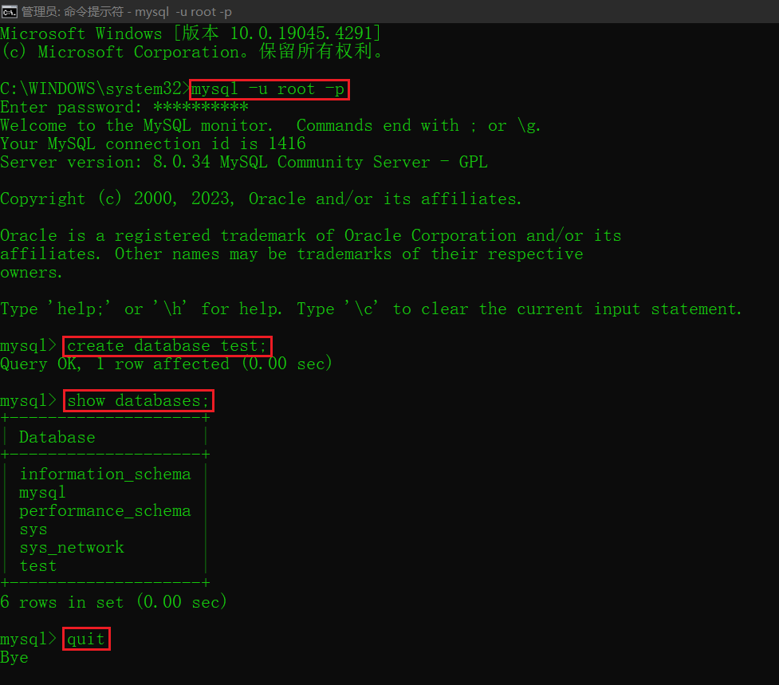
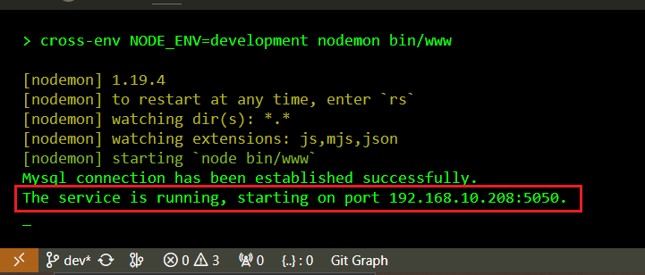

# 后端 nodejs 接口服务系统

## 项目介绍

koa 后端服务框架，开箱即用的脚手架，由 koa-generator 提供的 Koa2 命令安装实现，代码功能完全开源，用以给个性化独立网站提供必要的接口服务。

## 项目目录结构

[treer.md](./markdown/treer.md)

## 项目 start

:point_right:必备条件

> - node > 14.0
> - mysql > 8.0

### 初始化配置

在跑项目之前，首先要做的就是，在本地安装 mysql 8.0.* 数据库服务，当数据库准备完毕后，进行初始化数据库配置工作(这里需要在mysql内新建一个数据库)。

项目中集成了 sequelize 第三方库管理数据库，因此后续操作须按照如下进行：

简单描述下该如何配置操作：

- 1. 打开Termimal（比如vsCode自带的命令行终端，或者启动计算机系统的命令行终端），输入 mysql -u root -p 命令进入到 mysql 环境下
- 2. 创建一个数据库，比如我在这里创建一个名叫 test 的数据库，输入 create databse test; 命令
- 3. 退出 mysql 环境，输入 quit 即可

这里贴张我的操作图片



- 4. 打开Termimal（比如vsCode自带的命令行终端，或者启动计算机系统的命令行终端），在终端中切到该项目的 /shell 目录下

- 5. 在终端中使用 node 命令执行 /shell/modifyFile.js 脚本文件

```shell{.line-numbers}
# 输入该命令并执行，命令后面需要带4个参数，这四个参数的含义分别为：localhost【主机地址】 root【数据库用户名】 123456【数据库密码】 test【数据库名称】
# 请注意，我下面的这个命令及参数只是针对当前自己的数据库环境来执行的，因此这四个参数必须根据实际的数据库配置来进行输入
F:\VS-Worker\EspressoKoaServer\shell>node modifyFile.js localhost root 123456 test
```

- 6. 下一步，可以安装 node_modules 依赖包啦，终端执行pnpm install就好啦

- 7. 下面马上满怀期待的跑项目吧，直接终端运行 npm run start:dev 命令

- 8. 如果一切顺利，项目就可以跑起来啦，随后可以在浏览器上访问 Swagger UI 在线文档啦，比如我的计算机 IP 地址是 192.168.1.10，那么直接在浏览器上访问 http://192.168.1.10:5050/swagger-ui/ 就可以啦

> 如果不知道本地计算机的 IP 地址是多少，当然问题不大，可以直接在终端上查看，看下面的贴图哦



- 9. 最后一步就是同步模型啦，先别管同步模型是个什么东东，搞就完了，在浏览器打开的 Swagger UI 在线文档的公共模块中找到脚本运行的接口，运行它就 OK 了，此时你再次进入到 mysql 环境下，就会惊奇的发现，多了几张表出来。嘿，太神奇了

有关于Sequelize的介绍，我写了简单的文档，已经放到了 [这里](./markdown/Sequelize.md)

### 项目 install & run

```shell{.line-numbers}
git clone https://github.com/MFanLiang/EspressoKoaServer.git

cd EspressoKoaServer

npm config set --registry=https://registry.npm.taobao.org

pnpm install

pnpm run start:dev
```

## 功能点

- [x] 登录能力
- [x] 注销能力
- [x] token权限验证
- [x] 系统日志文件
- [x] swagger文档
- [x] Sequelize映射
- [x] 邮件功能
- [x] 异常处理
- [x] 静态资源目录
- [x] 文件上传
- [x] 账号鉴权，一个账号只允许在一台设备上登录，若违反规则将会限制登录；不同账号可在同一台设备上登录
- [x] 按钮权限，根据用户角色获取不同的权限按钮
- [ ] 路由菜单权限，根据用户角色获取不同的路由菜单

## 注意事项及问题

[Q&A.md](./markdown/Q&A.md)
